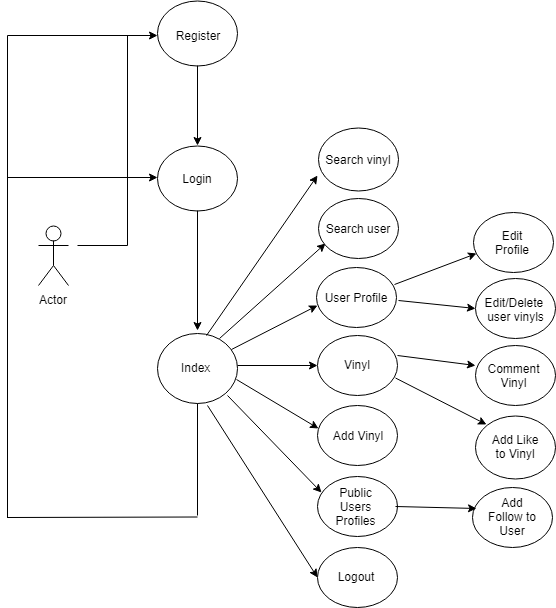
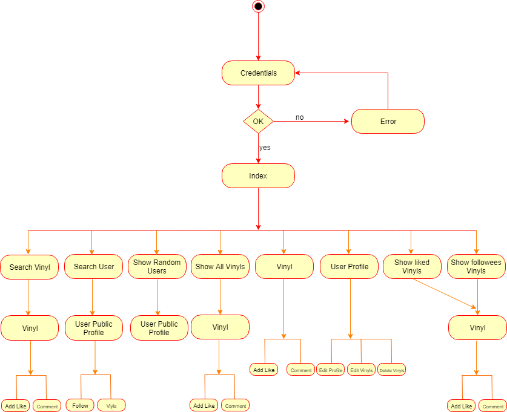
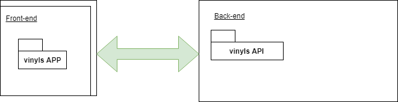

# Vinyls

## Introduction

The application allows its use by registering users. The user can upload their vinyls, follow other users, likes vinyls, add comment to vinyls.

You can also searches for users and serach for vinyls

Each user has a profile page where they can see their data as related vinyls.

The user can have a section where they can edit their personal data, profile photo, edit or delete his vinyls.

### Use cases diagram

## Activity Diagram

The application has two main activities: search for an event and save an event in a favourites list. You can click on an event for more information. With regard to the favourites list, you can also delete the event any time.

## Block diagram
The front end of the application was built using React. The back end is connected to 2 APIs: the first one to manage the users and store the favourite events of each user, and the second one to retrieve the information from all the available events that are shown to the user.

## Components Diagram
The application has some react components, the business logic and the two APIs used: Ticketmaster and Skylabcoders.

## Sequence Diagram
The most significant tasks of the application are those that use the APIs. Skylab Coders API is used to save the user data (for register and login purposes) and the user’s favourites list. Ticketmaster API is used to search for events and display its details when an event is clicked.

## Entity Relation Diagram

## Technology Stack

* HTML
* CSS
* Javascript (ES6)
* React
* React Router
* MD Bootstrap React
* APIs
